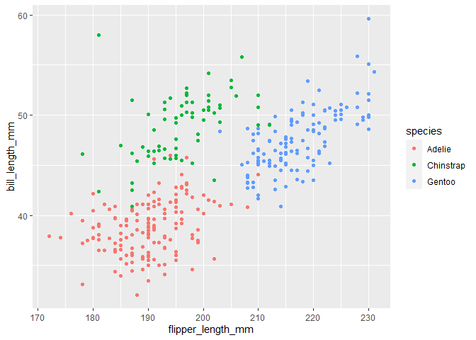

p8105\_hw1\_lw2883
================
Leighanne Wang
9/13/2020

# Problem 1

Creating a data frame with variables

``` r
problem1_df = tibble(
  norm_sample = rnorm(10),
  norm_sample_pos = norm_sample > 0
)
```

Finding the mean of each variable in data frame

``` r
mean(pull(problem1_df, norm_sample))
## [1] -0.08967746
mean(pull(problem1_df, norm_sample_pos))
## [1] 0.4
```

Applying as.numeric function to logical, character, and factor variables

``` r
as.numeric(pull(problem1_df, norm_sample_pos))
##  [1] 1 0 1 0 0 0 0 0 1 1
```

# Problem 2

Load the penguins dataset

``` r
data("penguins", package = "palmerpenguins")

summary(penguins)
```

Description of Data Set

  - This dataset has 8 variables defined including species, island, bill
    length (in mm), bill depth (in mm), flipper length (in mm), body
    mass (in g), sex, and year. This dataset has information from
    **2007** to **2009**. The different species of penguins in this
    dataset are **Adelie, Chinstrap, Gentoo** and the different islands
    in this dataset are **Biscoe, Dream, Torgersen**.
  - The dataset has **344** rows and **8** columns.
  - The mean flipper length is **NA**.

Scatterplot

``` r
ggplot(penguins, aes(x = flipper_length_mm, y = bill_length_mm, color = species)) + geom_point()
```

<!-- -->

``` r
ggsave
```

    ## function (filename, plot = last_plot(), device = NULL, path = NULL, 
    ##     scale = 1, width = NA, height = NA, units = c("in", "cm", 
    ##         "mm"), dpi = 300, limitsize = TRUE, ...) 
    ## {
    ##     dpi <- parse_dpi(dpi)
    ##     dev <- plot_dev(device, filename, dpi = dpi)
    ##     dim <- plot_dim(c(width, height), scale = scale, units = units, 
    ##         limitsize = limitsize)
    ##     if (!is.null(path)) {
    ##         filename <- file.path(path, filename)
    ##     }
    ##     old_dev <- grDevices::dev.cur()
    ##     dev(filename = filename, width = dim[1], height = dim[2], 
    ##         ...)
    ##     on.exit(utils::capture.output({
    ##         grDevices::dev.off()
    ##         if (old_dev > 1) grDevices::dev.set(old_dev)
    ##     }))
    ##     grid.draw(plot)
    ##     invisible()
    ## }
    ## <bytecode: 0x0000000019b3f510>
    ## <environment: namespace:ggplot2>
